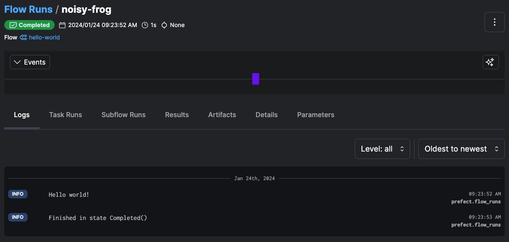

# Install and Auth Quickstart

If you are a python beginner, please head to our [getting started guide for python beginners guide](getting_started_for_python_beginners.md) where we walk through creating a python virtual environment before installing prefect.

## 1. [Log into Cloud from your browser](https://app.prefect.cloud/)

Much of Prefect's functionality is backed by an API. Sign up for a forever free Prefect Cloud account or accept your organization's invite to join their Prefect Cloud account. To access Prefect's UI, head to our [SSO login page](https://app.prefect.cloud/auth/discovery) to sign in to Prefect Cloud.

⚠️‼️ IF your company has already set up SSO, please click `Sign in with SSO` to avoid creating a duplicate account.


## 2. Ensure you have prefect installed

Now that you've logged into the cloud UI, we need to set up your local dev environment so that you can author flows.

For more info see our [Install Guide](https://docs.prefect.io/latest/getting-started/installation/)!

```bash
pip install -U prefect 
```

Check that you have a recent version:

```bash
prefect version
```


## 3. [Log in to Cloud](https://docs.prefect.io/latest/cloud/connecting/#log-into-prefect-cloud-from-a-terminal) from a terminal

```bash
prefect cloud login
```

Select **Log in with a web browser**


#### Alternatively, manually login with API key


Find trouble shooting tips for login errors [here](https://docs.prefect.io/latest/cloud/connecting/#prefect-cloud-login-errors)!

## 4. [Change Workspaces](https://docs.prefect.io/latest/cloud/connecting/#change-workspaces) to your workspace of choice

```bash
prefect cloud workspace set
```

Then select the desired workspace from list if there is more than one, press enter if there is only one.

## 5. Run a [hello world flow](hello_world_flow.py) and verify that you can see the flow run in the UI

`pacc2024/hello_world_flow.py`

```python
from prefect import flow

@flow(log_prints=True)
def hello_world():
    print("Hello world!")

if __name__ == "__main__":
    hello_world()
```

```bash
python pacc2024/hello_world_flow.py
```

Click on the link listed in the flow run logs:

```bash
(venv) ➜  prefect-pacc-2024 git:(main) python hello_world_flow.py 
09:23:52.648 | INFO    | prefect.engine - Created flow run 'noisy-frog' for flow 'hello-world'
09:23:52.650 | INFO    | Flow run 'noisy-frog' - View at https://app.prefect.cloud/account/9b649228-0419-40e1-9e0d-44954b5c0ab6/workspace/f7fe0729-5a91-40a4-a800-4bb8c5b6a6f5/flow-runs/flow-run/ea412cbd-9878-41e6-9e36-0be279230875
09:23:52.867 | INFO    | Flow run 'noisy-frog' - Hello world!
09:23:53.393 | INFO    | Flow run 'noisy-frog' - Finished in state Completed()
```

In the UI, you should see a flow run with a randomly generated adjective-animal name that has no tasks:


🎉 Congrats! You're all set to start diving in and learning Prefect!

## (Optional) [Prefect Profiles](https://docs.prefect.io/latest/guides/settings/#configuration-profiles)

Prefect allows you to persist settings instead of setting an environment variable each time you open a new shell. Settings are persisted to profiles, which allow you to move between groups of settings quickly.

To create a profile:

```bash
prefect profile create test
```

To switch to a selected profile:

```bash
prefect profile use test
```

Profiles are stored by default in your PREFECT_HOME directory:

```bash
vim ~/.prefect/profiles.toml
```

Example `profiles.toml` file:

```toml
active = "default"

[profiles.local]
PREFECT_API_URL = "http://127.0.0.1:4200/api"

[profiles.default]
PREFECT_API_KEY = "pnu_----replace-me----"
PREFECT_API_URL = "https://api.prefect.cloud/api/accounts/--replace-me--/workspaces/--replace-me--"

[profiles.staging]
PREFECT_API_KEY = "pnu_----replace-me----"
PREFECT_API_URL = "https://api.prefect.cloud/api/accounts/--replace-me--/workspaces/--staging-workspace-replace-me--"
PREFECT_LOGGING_LEVEL = "DEBUG"

[profiles.n]
PREFECT_API_KEY = "pnu_----replace-me----"
PREFECT_API_URL = "https://api.prefect.cloud/api/accounts/--replace-me--/workspaces/--n-workspace-replace-me--"
```
